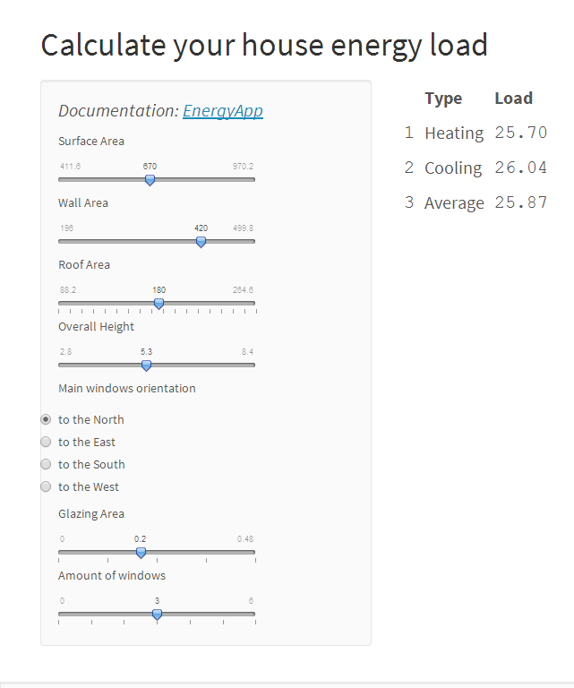

   
      
         
            
               
               

What would be more economically in terms of energy, one floor house with one big window or a two floors house with many small windows.   
Estimate with our Application!   

--- &radio

### Guess

What property of your house impacts the energy consumtion mostly?

1. House area
2. _House height_
3. Glazing area
4. Glazing dispersion

*** .hint   
probably not the most obvious
*** .explanation
warm air is cooling while going up


--- .class #id 

### Our data


The data is kindly provided by the UCI machine learning repository. You can take it here https://archive.ics.uci.edu/ml/datasets/Energy+efficiency#   

```{r echo=FALSE,eval=TRUE,warning=FALSE,message=FALSE,cache=TRUE}
suppressWarnings(library(XLConnect))
d <- readWorksheet(loadWorkbook("../energy.xlsx"),sheet=1)
names(d)<-c("co","sa","wa","ra","oh","or","ga","gd","hl","cl")
```

It contains `r I(nrow(d))` houses parameters and their heating and cooling values parameters.

--- .class #id 

### Use the app

Use our [simple app](http://rogdenis.shinyapps.io/shiny/ "EnergyApp") and select the design of the house that will save your money. It easy, try it out! 


http://rogdenis.shinyapps.io/shiny/

