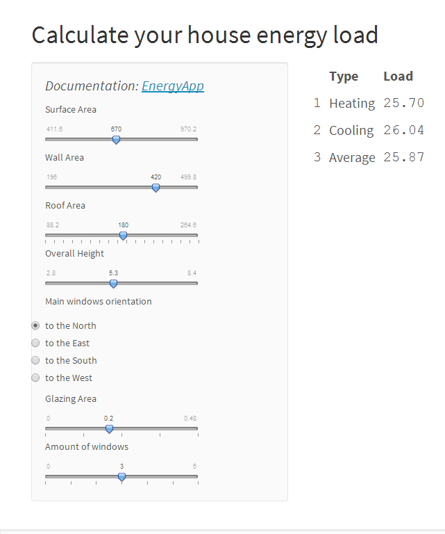

### Contents

1. Purpose of the App
2. Getting data
3. Train prediction model
4. Use the app

--- .class #id 

### Purpose of the App


An energy load is a measurement of how much power is required per hour to heat a given space, and to maintain a desired temperature.   
The goal of the application is to give it's users an easy way to estimate the energy consumption of their houses.

--- .class #id 

### Getting data


The data is provided by the UCI machine learning repository: https://archive.ics.uci.edu/ml/datasets/Energy+efficiency#   
It contains 768 houses parameters and their heating and cooling values parameters.
It is downloaded, you can use it by this code:

```{r echo=TRUE,eval=FALSE}
library(XLConnect)
d <- readWorksheet(loadWorkbook("energy.xlsx"),sheet=1)
names(d)<-c("co","sa","wa","ra","oh","or","ga","gd","hl","cl")
```


--- .class #id 

### Train prediction model

The audience of the application is people who are not familiar with any field of computer science, so it should be easy to interpret the prediction model, and it should be fast as well.
   
The following code makes a prediction model and saves it for server.R:
```{r echo=TRUE,eval=FALSE}
library(caret)
method="lm" #your method
ctrl <- trainControl(verboseIter=TRUE,method = "cv",number=10)
cool<-train(cl~sa + wa + ra + oh + or + ga + gd,d,method=method,trControl = ctrl)
heat<-train(hl~sa + wa + ra + oh + or + ga + gd,d,method=method,trControl = ctrl)
save(cool,file="cool.RData")
save(heat,file="heat.RData")
```
You can use any other method instead

--- .class #id 

### Use the app

By itself the app is really simple, it consists of sliders and one radio button block. As the user changes the value of each input block, we recalculate the load values.

